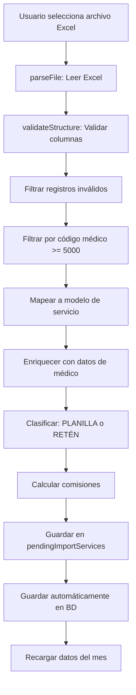
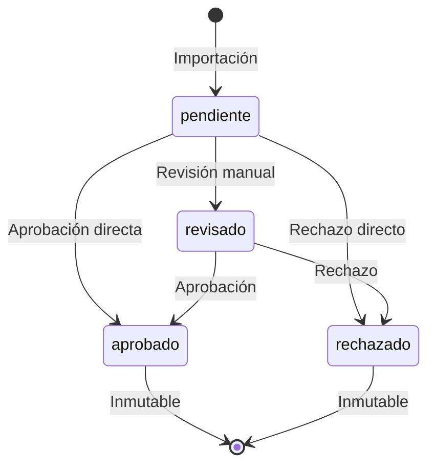

# Reglas de Negocio: Sistema de Comisiones Médicas

## Descripción General

El sistema de **Honorarios Médicos** ([MedicalFees.vue](file:///c:/DesarrolloWeb/csr-app/src/views/doctors/MedicalFees.vue)) gestiona el cálculo, clasificación y aprobación de comisiones para servicios médicos. El sistema procesa atenciones médicas y determina automáticamente si corresponden a **PLANILLA** o **RETÉN**, calculando las comisiones según reglas de negocio específicas.

---

## 1. Clasificación de Servicios: PLANILLA vs RETÉN

### 1.1 Criterios de Clasificación

La clasificación se realiza en [ServiceClassifier.js](file:///c:/DesarrolloWeb/csr-app/src/services/medicalFees/ServiceClassifier.js#L12-L98) y se basa en:

#### **PLANILLA** (Horario Regular)

Un servicio es clasificado como **PLANILLA** cuando:

- ✅ El médico tiene un horario registrado para ese día
- ✅ La hora de atención está dentro del rango del horario
- ✅ El horario tiene la bandera `is_payment_payroll = true`

**Ejemplo:**

```
Médico: Dr. Juan Pérez (código 5001)
Horario: Turno M (08:00-14:00) - is_payment_payroll: true
Atención: 10:30 AM
Resultado: PLANILLA - "Turno M (08:00-14:00)"
```

#### **RETÉN** (Fuera de Horario/Guardia)

Un servicio es clasificado como **RETÉN** cuando:

- ❌ No hay horarios registrados para el médico ese día
- ❌ La hora de atención está fuera de los horarios registrados
- ❌ El horario tiene `is_payment_payroll = false`
- ⚠️ La hora de atención no está especificada

**Ejemplo:**

```
Médico: Dr. Juan Pérez (código 5001)
Horario: Turno N (20:00-08:00) - is_payment_payroll: false
Atención: 23:00 PM
Resultado: RETÉN - "Turno N - No planilla"
```

### 1.2 Validaciones Especiales de Clasificación

#### ⚠️ Código SEGUS indica RETÉN pero horario es PLANILLA

```javascript
// ServiceClassifier.js líneas 44-49
if (segusIndicatesReten && schedule.is_payment_payroll) {
    return {
        type: 'PLANILLA',
        reason: '⚠️ OBSERVACIÓN: Código SEGUS indica RETÉN pero se realizó en horario PLANILLA'
    };
}
```

#### ⚠️ Clasificado como RETÉN pero código NO indica RETÉN

```javascript
// ServiceClassifier.js líneas 61-66
if (!segusIndicatesReten && !schedule.is_payment_payroll) {
    return {
        type: 'RETÉN',
        reason: '⚠️ Revisar atención, codigo NO RETEN'
    };
}
```

#### ⚠️ PARTICULAR sin Tarifario Configurado (Revisión Manual)

```javascript
// useMedicalFees.js líneas 244-256
if (isParticular && !hasCommission) {
    const tariff = doctorTariffsStore.allTariffs.find((t) => t.tariff_code === codSeg && t.doctor_code === doctorCode);

    if (!tariff) {
        detalle += ' ⚠️ SIN TARIFARIO PARTICULAR - Revisar si ingreso fue para clínica o médico cobró con tarifa general';
    }
}
```

**Justificación:**

Cuando un servicio es PARTICULAR pero NO tiene tarifario personalizado configurado:

- **Comisión:** Se mantiene en S/ 0.00 (no se paga automáticamente)
- **Alerta:** Se agrega mensaje de revisión manual
- **Razón:** El ingreso pudo haber sido:
    - Todo para la clínica (debería recibir comisión)
    - Médico cobró con código de tarifa general (ya recibió su pago)

**Acción requerida:** Revisión manual para determinar si corresponde pagar comisión.

---

## 2. Cálculo de Comisiones

El cálculo de comisiones se realiza en [useMedicalFees.js](file:///c:/DesarrolloWeb/csr-app/src/composables/medicalFees/useMedicalFees.js#L49-L102) mediante la función `calculateCommissionRule()`.

### 2.1 Regla 1: Servicios PLANILLA

#### Condiciones Base

Para que un servicio PLANILLA tenga comisión:

1. ✅ El servicio debe ser clasificado como `PLANILLA`
2. ✅ NO debe ser un código de consulta excluido
3. ✅ El médico debe tener `commission_percentage > 0`

#### Códigos de Consulta Excluidos (Sin Comisión)

```javascript
// Líneas 57-62
const consultationCodes = ['00.19.25', '00.19.27'];
const isConsultationCode = (segusCode?.startsWith('50.0') && segusCode !== '50.03.00') || consultationCodes.includes(segusCode);
```

> **Excepción Importante:** El código `50.03.00` (CONSULTA EN PACIENTE HOSPITALIZADO) **SÍ tiene comisión** aunque comience con `50.0`.

#### Lógica de Aplicación según Compañía

##### Para Compañía = "PARTICULAR"

```javascript
// Líneas 74-78
if (company === 'PARTICULAR') {
    shouldApplyCommission = tariff && parseFloat(tariff.clinic_commission) > 0 && (tariff.doctor_commission === null || parseFloat(tariff.doctor_commission) === 0);
}
```

**Condiciones:**

- ✅ Debe existir un tarifario personalizado del médico (`doctor_tariffs`)
- ✅ `clinic_commission > 0` (la clínica cobra comisión)
- ✅ `doctor_commission = 0 o NULL` (el médico NO tiene tarifa personalizada)

**Implicancia:** Si el médico tiene una tarifa personalizada para PARTICULAR (`doctor_commission > 0`), **NO se le paga comisión** porque ya está cobrando su tarifa especial.

##### Para Otras Compañías (Seguros, EPS, etc.)

```javascript
// Líneas 79-82
else {
    shouldApplyCommission = true; // Siempre aplica si es PLANILLA
}
```

**Condiciones:**

- ✅ Solo debe ser PLANILLA y no ser código de consulta excluido

#### Cálculo del Monto de Comisión

```javascript
// Líneas 86-93
if (shouldApplyCommission) {
    const commissionPercentage = doctor?.commission_percentage;

    if (commissionPercentage && parseFloat(commissionPercentage) > 0) {
        const percentage = parseFloat(commissionPercentage) / 100;
        comision = parseFloat((importe * percentage).toFixed(2));
    }
}
```

**Fórmula:**

```
Comisión = Monto del Servicio × (commission_percentage / 100)
```

**Ejemplo:**

```
Servicio: Ecografía - S/ 150.00
Médico: Dr. Juan Pérez - commission_percentage: 40%
Comisión = 150.00 × 0.40 = S/ 60.00
```

### 2.2 Regla 2: Servicios RETÉN (Seguros/EPS)

#### Condiciones

```javascript
// Líneas 96-99
else if (isReten && company !== 'PARTICULAR') {
    comision = parseFloat((importe * 0.925).toFixed(2));
}
```

**Condiciones:**

- ✅ El servicio debe ser clasificado como `RETEN` o `RETÉN`
- ✅ La compañía NO debe ser "PARTICULAR"

**Fórmula Fija:**

```
Comisión = Monto del Servicio × 92.5%
```

**Ejemplo:**

```
Servicio: Atención de Emergencia - S/ 200.00
Compañía: ESSALUD
Comisión = 200.00 × 0.925 = S/ 185.00
```

### 2.3 Regla 3: Servicios RETÉN + PARTICULAR (Nuevo)

#### Condiciones

```javascript
// Líneas 100-124
else if (isReten && company === 'PARTICULAR') {
    const tariff = doctorTariffsStore.allTariffs.find(t =>
        t.tariff_code === segusCode && t.doctor_code === doctorCode
    );

    if (tariff &&
        parseFloat(tariff.clinic_commission) > 0 &&
        (tariff.doctor_commission === null || parseFloat(tariff.doctor_commission) === 0)) {

        const percentage = parseFloat(commissionPercentage) / 100;
        comision = parseFloat((importe * percentage).toFixed(2));
    }
}
```

**Condiciones:**

- ✅ El servicio debe ser clasificado como `RETEN` o `RETÉN`
- ✅ La compañía debe ser "PARTICULAR"
- ✅ Debe existir un tarifario personalizado del médico
- ✅ El tarifario debe indicar `clinic_commission > 0` (la clínica cobra)
- ✅ El tarifario debe indicar `doctor_commission = 0 o NULL` (el médico NO tiene tarifa especial)

**Fórmula:**

```
Comisión = Monto del Servicio × (commission_percentage / 100)
```

**Ejemplo:**

```
Dr. Juan Pérez (código 5001)
commission_percentage: 40%

Tarifario Personalizado:
- Código: ECO-001
- clinic_commission: 150.00 (todo para clínica)
- doctor_commission: 0 (médico no cobra tarifa especial)

Servicio: Ecografía de Emergencia (RETÉN) - S/ 150.00
Compañía: PARTICULAR
Hora: 23:00 PM (fuera de horario)

Resultado:
- Tipo: RETÉN
- Comisión: S/ 60.00 (150 × 40%)
```

> **Justificación:** Aunque es PARTICULAR, el médico trabajó fuera de horario (RETÉN) y todo el ingreso es para la clínica. Por lo tanto, merece su comisión por el trabajo en guardia.

**Caso contrario (sin comisión):**

```
Tarifario Personalizado:
- doctor_commission: 120.00 (médico cobra tarifa especial)
- clinic_commission: 30.00

Resultado:
- Tipo: RETÉN
- Comisión: S/ 0.00 (ya cobra su tarifa de S/ 120.00)
```

> **Importante:** Para servicios RETÉN con compañía "PARTICULAR", la comisión es **S/ 0.00** si el médico tiene una tarifa personalizada (`doctor_commission > 0`) o si no existe un tarifario que indique que la clínica cobra y el médico no.

### 2.4 Tabla Resumen de Reglas de Comisión

| Tipo     | Compañía    | Código Servicio                      | Tarifa Médico                                          | Comisión                                      |
| -------- | ----------- | ------------------------------------ | ------------------------------------------------------ | --------------------------------------------- |
| PLANILLA | PARTICULAR  | Normal                               | `doctor_commission = 0/NULL` y `clinic_commission > 0` | `monto × commission_percentage%`              |
| PLANILLA | PARTICULAR  | Normal                               | `doctor_commission > 0`                                | **S/ 0.00** (tiene tarifa especial)           |
| PLANILLA | PARTICULAR  | Consulta (50.0x, 00.19.25, 00.19.27) | Cualquiera                                             | **S/ 0.00** (excluido)                        |
| PLANILLA | Seguros/EPS | Normal                               | Cualquiera                                             | `monto × commission_percentage%`              |
| PLANILLA | Seguros/EPS | Consulta (50.0x, 00.19.25, 00.19.27) | Cualquiera                                             | **S/ 0.00** (excluido)                        |
| PLANILLA | Cualquiera  | 50.03.00                             | Cualquiera                                             | `monto × commission_percentage%` (excepción)  |
| RETÉN    | PARTICULAR  | Cualquiera                           | `doctor_commission = 0/NULL` y `clinic_commission > 0` | `monto × commission_percentage%` ✨ **NUEVO** |
| RETÉN    | PARTICULAR  | Cualquiera                           | `doctor_commission > 0` o sin tarifario                | **S/ 0.00**                                   |
| RETÉN    | Seguros/EPS | Cualquiera                           | Cualquiera                                             | `monto × 92.5%`                               |

---

## 3. Flujo de Procesamiento

### 3.1 Importación desde Excel



**Código relevante:** [useMedicalFees.js](file:///c:/DesarrolloWeb/csr-app/src/composables/medicalFees/useMedicalFees.js#L136-L267)

### 3.2 Filtros Aplicados en Importación

#### Exclusión de Registros

```javascript
// ExcelParserService.shouldExcludeRecord()
- Registros sin código médico
- Registros sin fecha
- Registros sin importe
- Registros con importe = 0
```

#### Filtro por Código Médico

```javascript
// Líneas 159-165
const filteredByDoctorCode = validData.filter((row) => {
    const doctorCode = row.cod_seri?.toString().trim();
    const codeNumber = parseInt(doctorCode, 10);
    return !isNaN(codeNumber) && codeNumber >= 5000;
});
```

**Implicancia:** Solo se procesan servicios de médicos con código >= 5000, excluyendo personal administrativo o servicios no médicos.

---

## 4. Estados de Aprobación

### 4.1 Ciclo de Vida de un Servicio



### 4.2 Estados Disponibles

| Estado      | Color           | Descripción                                      | Editable         |
| ----------- | --------------- | ------------------------------------------------ | ---------------- |
| `pendiente` | Amarillo (warn) | Servicio importado, pendiente de revisión        | ✅ Sí            |
| `revisado`  | Azul (info)     | Servicio revisado, pendiente de aprobación final | ✅ Sí            |
| `aprobado`  | Verde (success) | Servicio aprobado para pago                      | ❌ **Inmutable** |
| `rechazado` | Rojo (danger)   | Servicio rechazado, no se pagará                 | ❌ **Inmutable** |

### 4.3 Aprobación Masiva

**Funcionalidad:** [BulkApprovalDialog.vue](file:///c:/DesarrolloWeb/csr-app/src/components/doctors/BulkApprovalDialog.vue)

```javascript
// useMedicalFees.js líneas 770-778
async function bulkApproveServices(ids, status, observation = null) {
    const result = await MedicalFeesService.bulkApprove(ids, status, observation);
    return result;
}
```

**Características:**

- ✅ Permite cambiar el estado de múltiples servicios simultáneamente
- ✅ Requiere seleccionar un médico específico
- ✅ Permite agregar observaciones opcionales
- ⚠️ Servicios en estado `aprobado` o `rechazado` son **omitidos** (inmutables)

**Código relevante:** [MedicalFees.vue](file:///c:/DesarrolloWeb/csr-app/src/views/doctors/MedicalFees.vue#L514-L547)

---

## 5. Edición de Servicios

### 5.1 Campos Editables

Los servicios pueden ser editados directamente en la tabla mediante edición inline:

```javascript
// MedicalFees.vue líneas 42-86
async function onCellEditComplete(event) {
    const { data, newValue, field } = event;

    // Validaciones
    if (field === 'amount' || field === 'comision') {
        if (isNaN(newValue) || newValue < 0) {
            // Revertir cambio
        }
    }

    await updateService(data.id, field, newValue);
}
```

### 5.2 Recálculo Automático de Comisión

Cuando se edita el **tipo de servicio** o el **monto**, la comisión se recalcula automáticamente:

```javascript
// useMedicalFees.js líneas 718-735
if (field === 'serviceType' || field === 'amount') {
    const type = field === 'serviceType' ? newValue : service.serviceType;
    const amount = field === 'amount' ? newValue : service.amount;

    const newCommission = calculateCommissionRule({
        type: type,
        amount: amount,
        cia: service.cia,
        doctorCode: service.doctorCode,
        segusCode: service.rawData?.segus,
        doctor: service.doctor
    });

    payload.commission_amount = newCommission;
}
```

**Implicancia:** Si un administrador cambia un servicio de RETÉN a PLANILLA, la comisión se recalcula automáticamente según las reglas correspondientes.

---

## 6. Visualización y Reportes

### 6.1 Resumen General

La vista muestra 4 tarjetas de resumen:

1. **Total Generado:** Suma de todos los montos de servicios
2. **Planilla:** Suma de servicios tipo PLANILLA + cantidad
3. **Retén:** Suma de servicios tipo RETÉN + cantidad
4. **Médicos:** Cantidad de médicos únicos + total de servicios

**Código:** [MedicalFees.vue](file:///c:/DesarrolloWeb/csr-app/src/views/doctors/MedicalFees.vue#L182-L202)

### 6.2 Resumen por Médico

Tabla agrupada que muestra para cada médico:

```javascript
// MedicalFees.vue líneas 216-255
{
    codigo: doctorCode,
    nombre: doctorName,
    cantidadPlanilla: 0,
    montoPlanilla: 0,
    cantidadReten: 0,
    montoReten: 0,
    totalComision: 0,
    totalAtenciones: 0,
    totalGenerado: 0
}
```

**Uso:** Permite ver de forma consolidada cuánto generó cada médico y cuánto se le debe pagar en comisiones.

### 6.3 Exportación a Excel

La exportación genera un archivo con **2 hojas**:

#### Hoja 1: "Honorarios Médicos" (Detalle)

Columnas:

- Admisión, Código Médico, Fecha, Hora
- Médico, Paciente, Servicio, Código Servicio
- Monto, Tipo, Detalle, **Comisión**
- CIA, Comprobante, Tipo Atención, Area

#### Hoja 2: "Resumen por Médico"

Columnas:

- Código Médico, Médico
- Cant. Planilla, Monto Planilla
- Cant. Retén, Monto Retén
- **Total Comisión**, Total Atenciones, Total Generado

**Código:** [useMedicalFees.js](file:///c:/DesarrolloWeb/csr-app/src/composables/medicalFees/useMedicalFees.js#L343-L572)

---

## 7. Implicancias de Negocio

### 7.1 Impacto Financiero

#### Para la Clínica

- Los servicios PLANILLA generan **menor costo** en comisiones (depende del `commission_percentage` del médico, típicamente 30-50%)
- Los servicios RETÉN generan **mayor costo** en comisiones (92.5% fijo)
- Los servicios PARTICULAR con tarifa personalizada del médico **no generan comisión adicional**

#### Para los Médicos

- Servicios PLANILLA: Reciben un porcentaje del monto según su `commission_percentage`
- Servicios RETÉN: Reciben 92.5% del monto (compensación por trabajar fuera de horario)
- Consultas básicas en PLANILLA: **No reciben comisión** (ya están en planilla base)

### 7.2 Validaciones de Integridad

#### ⚠️ Alertas Automáticas

El sistema genera alertas cuando detecta inconsistencias:

1. **"Código SEGUS indica RETÉN pero se realizó en horario PLANILLA"**
    - Posible error en la asignación del código de servicio
    - Requiere revisión manual

2. **"⚠️ Revisar atención, codigo NO RETEN"**
    - Servicio clasificado como RETÉN pero el código no lo indica
    - Puede ser un error de registro de horario

### 7.3 Control de Costos

#### Estrategias de Optimización

1. **Registrar horarios correctamente:** Evita que servicios PLANILLA se clasifiquen como RETÉN
2. **Configurar `commission_percentage` adecuadamente:** Controla el costo de comisiones en PLANILLA
3. **Usar tarifas personalizadas para PARTICULAR:** Evita pagar comisión adicional cuando el médico ya tiene tarifa especial

---

## 8. Casos de Uso Prácticos

### Caso 1: Médico con Horario Regular

```
Dr. Juan Pérez (código 5001)
commission_percentage: 40%
Horario: Lunes 08:00-14:00 (PLANILLA)

Servicio: Ecografía - S/ 150.00
Fecha: Lunes 10:30 AM
Compañía: ESSALUD

Resultado:
- Tipo: PLANILLA
- Comisión: S/ 60.00 (150 × 40%)
```

### Caso 2: Médico en Guardia Nocturna

```
Dr. María López (código 5002)
Horario: Martes 20:00-08:00 (RETÉN)

Servicio: Atención de Emergencia - S/ 200.00
Fecha: Martes 23:00 PM
Compañía: RIMAC

Resultado:
- Tipo: RETÉN
- Comisión: S/ 185.00 (200 × 92.5%)
```

### Caso 3: Consulta Excluida

```
Dr. Carlos Ruiz (código 5003)
commission_percentage: 35%

Servicio: Consulta Externa (código 50.01.00) - S/ 80.00
Fecha: Miércoles 09:00 AM (PLANILLA)
Compañía: PARTICULAR

Resultado:
- Tipo: PLANILLA
- Comisión: S/ 0.00 (código excluido)
```

### Caso 4: Médico con Tarifa Personalizada

```
Dr. Ana Torres (código 5004)
commission_percentage: 45%

Tarifario Personalizado:
- Código: ECO-001
- doctor_commission: 120.00
- clinic_commission: 30.00

Servicio: Ecografía (ECO-001) - S/ 150.00
Compañía: PARTICULAR

Resultado:
- Tipo: PLANILLA
- Comisión: S/ 0.00 (tiene tarifa personalizada, cobrará S/ 120.00 directamente)
```

### Caso 5: RETÉN + PARTICULAR con Todo para Clínica ✨ NUEVO

```
Dr. Pedro Martínez (código 5005)
commission_percentage: 40%

Tarifario Personalizado:
- Código: ECO-001
- clinic_commission: 150.00 (todo para clínica)
- doctor_commission: 0 (médico NO cobra tarifa especial)

Servicio: Ecografía de Emergencia - S/ 150.00
Compañía: PARTICULAR
Fecha: Sábado 02:00 AM (fuera de horario)

Resultado:
- Tipo: RETÉN
- Comisión: S/ 60.00 (150 × 40%)

Justificación:
El médico trabajó en guardia (RETÉN) y todo el ingreso va para la clínica.
Por lo tanto, merece su comisión por el trabajo fuera de horario.
```

---

## 9. Consideraciones Técnicas

### 9.1 Dependencias

- **Tarifarios Médicos:** Se cargan desde `doctorTariffsStore`
- **Especialidades:** Se cargan desde `medicalSpecialtiesStore`
- **Horarios:** Se obtienen del backend según rango de fechas

### 9.2 Caché y Optimización

```javascript
// MedicalFees.vue líneas 478-488
if (specialtiesStore.allSpecialties.length > 0) {
    specialties.value = specialtiesStore.allSpecialties;
    console.log('Usando especialidades desde caché');
} else {
    await specialtiesStore.fetchSpecialties();
}
```

### 9.3 Inmutabilidad de Estados Finales

Los servicios en estado `aprobado` o `rechazado` **no pueden ser modificados** para mantener la integridad del registro contable.

---

## 10. Conclusión

El sistema de comisiones médicas implementa reglas de negocio complejas que balancean:

- ✅ Compensación justa para médicos (PLANILLA vs RETÉN)
- ✅ Control de costos para la clínica
- ✅ Flexibilidad para tarifas personalizadas
- ✅ Validaciones automáticas de integridad
- ✅ Trazabilidad mediante estados de aprobación

La automatización del cálculo reduce errores manuales y asegura consistencia en el pago de honorarios médicos.
